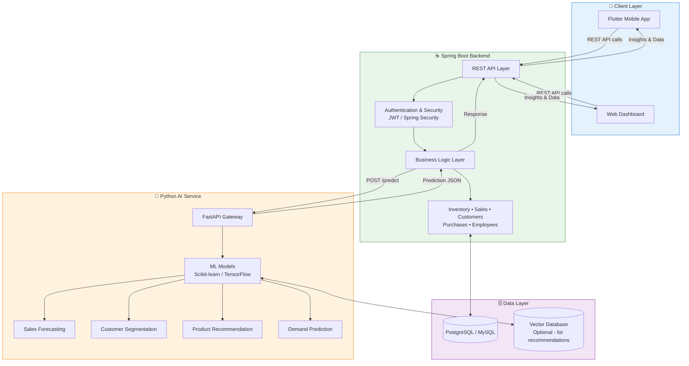
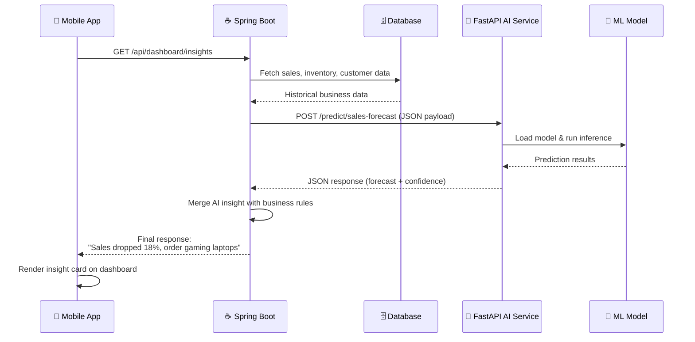
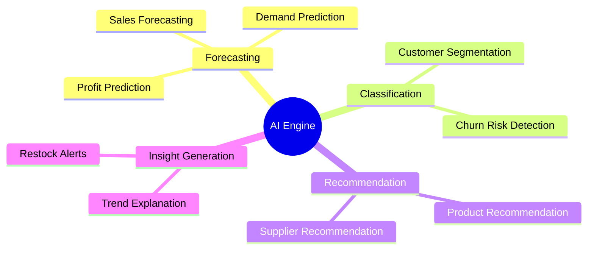
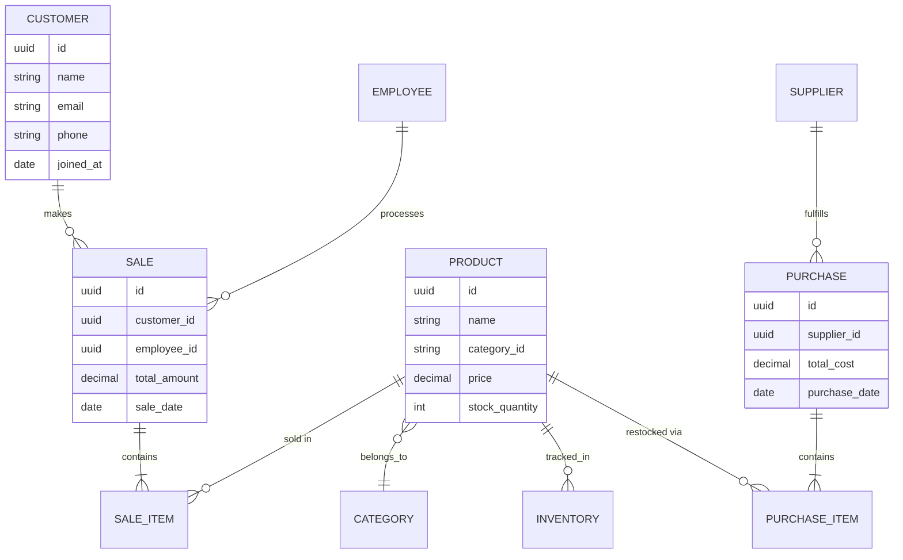
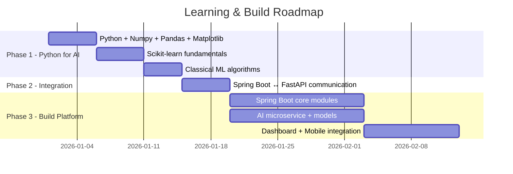

<div align="center">

# 🧠 AI Business Intelligence Platform

### Enterprise-grade Business Management System powered by AI Predictions

**Spring Boot** • **Python (FastAPI)** • **PostgreSQL** • **Flutter** • **Scikit-learn / TensorFlow**


*A real business platform that doesn't just show charts — it tells you **why** your sales dropped and **what to do next**.*

</div>

---

## 📖 Table of Contents

- [Overview](#-overview)
- [Why This Project Exists](#-why-this-project-exists)
- [System Architecture](#-system-architecture)
- [How Prediction Requests Flow](#-how-prediction-requests-flow)
- [Core Features](#-core-features)
- [AI Capabilities](#-ai-capabilities)
- [Tech Stack](#-tech-stack)
- [Project Structure](#-project-structure)
- [Database Schema (High Level)](#-database-schema-high-level)
- [Development Roadmap](#-development-roadmap)
- [Getting Started](#-getting-started)
- [API Reference](#-api-reference)
- [Screenshots / Dashboard Preview](#-screenshots--dashboard-preview)
- [Future Improvements](#-future-improvements)
- [Contributing](#-contributing)
- [License](#-license)

---

## 🚀 Overview

**AI Business Intelligence Platform** is a full-stack enterprise system designed for **any small-to-medium business** — retail stores, distributors, or service companies — that want more than a static dashboard.

Instead of just displaying numbers, the platform **interprets** them:

> 📉 *"Sales dropped 18% this week because laptop accessories decreased."*
> 📈 *"Top-selling products next month will likely be gaming laptops."*
> 📦 *"Order these products before stock runs out."*

The business logic (inventory, sales, customers, employees, purchases) is handled by a **Spring Boot** backend — the same reliable, secure, transactional system used in enterprise software today. The **AI/ML layer** lives entirely in a separate **Python (FastAPI)** microservice, which Spring Boot calls internally whenever a prediction is needed.

This separation means:
- Spring Boot never has to "understand" machine learning.
- Python never has to handle authentication, business rules, or transactions.
- Each service can be scaled, deployed, and maintained independently.

---

## 💡 Why This Project Exists

This project was built specifically as a **practical bridge between enterprise backend development and applied AI/ML** — learning machine learning *through* building real, usable enterprise software instead of studying ML theory in isolation.

The philosophy:

| Traditional ML Learning | This Project's Approach |
|---|---|
| Learn all of ML theory first | Learn ML by solving real business problems |
| Build isolated Jupyter notebooks | Build a production-style microservice |
| No integration experience | Real Spring Boot ↔ Python integration |
| Models never reach real users | Models power a real mobile/web dashboard |

---

## 🏗️ System Architecture



**Key principle:** Spring Boot is the **brain of the business logic**. Python is the **brain of the predictions**. They never overlap responsibilities.

---

## 🔄 How Prediction Requests Flow

Here's exactly what happens when the dashboard asks *"What will next month's top-selling product be?"*



This request/response cycle typically completes in **under 500ms** for lightweight models like Random Forest or Logistic Regression.

---

## ✨ Core Features

### 🏢 Spring Boot — Business Management

| Module | Description |
|---|---|
| **Inventory Management** | Track stock levels, categories, suppliers, low-stock alerts |
| **Sales Management** | Record transactions, generate invoices, track revenue |
| **Customer Management** | Customer profiles, purchase history, loyalty tracking |
| **Purchase Management** | Supplier orders, purchase history, cost tracking |
| **Employee Management** | Roles, permissions, performance tracking |
| **Authentication** | JWT-based auth, role-based access control (Admin/Manager/Staff) |

### 🤖 AI-Powered Intelligence

| Capability | Business Value |
|---|---|
| **Sales Forecasting** | Predict next week/month's revenue trends |
| **Demand Prediction** | Know which products will sell out and when |
| **Customer Segmentation** | Group customers by behavior (VIP, at-risk, new, loyal) |
| **Product Recommendation** | Suggest products to customers or restock priorities |
| **Profit Prediction** | Estimate future profit margins per product/category |
| **Supplier Recommendation** | Recommend best suppliers based on price, reliability, delivery time |
| **Anomaly Explanation** | Explain *why* a metric changed (not just that it changed) |

---

## 🧬 AI Capabilities



**Models used per feature:**

| Feature | Algorithm(s) |
|---|---|
| Sales Forecasting | Linear Regression, Random Forest Regressor |
| Demand Prediction | Decision Trees, Random Forest |
| Customer Segmentation | K-Means Clustering |
| Product Recommendation | Collaborative Filtering / Content-Based Filtering |
| Profit Prediction | Linear Regression, Gradient Boosting |
| Supplier Recommendation | Logistic Regression / Ranking model |

> No deep learning is required for v1 — classical ML is sufficient, faster to train, and easier to explain to business users. TensorFlow can be introduced later for advanced recommendation embeddings.

---

## 🛠️ Tech Stack

<div align="center">

| Layer | Technology |
|---|---|
| **Mobile App** | Flutter (Dart) |
| **Backend API** | Spring Boot 3.x (Java 17+) |
| **Security** | Spring Security + JWT |
| **Database** | PostgreSQL (or MySQL) |
| **AI Service** | Python 3.10+, FastAPI |
| **ML Libraries** | Scikit-learn, Pandas, NumPy |
| **Deep Learning (optional)** | TensorFlow / Keras |
| **Vector DB (optional)** | Pinecone / Weaviate / FAISS |
| **API Communication** | REST (JSON over HTTP) |
| **Deployment** | Docker, Docker Compose |

</div>

---

## 📁 Project Structure

```
ai-business-intelligence-platform/
│
├── backend-spring-boot/
│   ├── src/main/java/com/company/aibiplatform/
│   │   ├── config/              # Security, CORS, Swagger config
│   │   ├── controller/           # REST controllers
│   │   ├── service/               # Business logic
│   │   ├── repository/           # JPA repositories
│   │   ├── entity/                # DB entities
│   │   ├── dto/                   # Request/response DTOs
│   │   ├── client/                # Feign/RestTemplate client → calls FastAPI
│   │   └── AiBiPlatformApplication.java
│   ├── src/main/resources/
│   │   └── application.yml
│   └── pom.xml
│
├── ai-service-python/
│   ├── app/
│   │   ├── main.py                # FastAPI entrypoint
│   │   ├── routers/
│   │   │   ├── forecasting.py
│   │   │   ├── segmentation.py
│   │   │   └── recommendation.py
│   │   ├── models/                # Trained model files (.pkl)
│   │   ├── services/              # Prediction logic
│   │   └── schemas/               # Pydantic request/response models
│   ├── notebooks/                 # Training notebooks (EDA + training)
│   ├── requirements.txt
│   └── Dockerfile
│
├── mobile-app-flutter/
│   ├── lib/
│   │   ├── screens/
│   │   ├── models/
│   │   ├── services/api_service.dart
│   │   └── main.dart
│   └── pubspec.yaml
│
├── docker-compose.yml
├── .env.example
└── README.md
```

---

## 🗃️ Database Schema (High Level)



---

## 🗺️ Development Roadmap



| Phase | Focus | Duration |
|---|---|---|
| **Phase 1** | Learn Python for AI (NumPy, Pandas, Scikit-learn, classical ML) | ~2 weeks |
| **Phase 2** | Learn Spring Boot ↔ FastAPI communication pattern | ~1 week |
| **Phase 3** | Build the full AI Business Intelligence Platform | ~4–6 weeks |

---

## ⚙️ Getting Started

### Prerequisites
- Java 17+
- Maven 3.8+
- Python 3.10+
- PostgreSQL 14+
- Node/Flutter SDK (for mobile app)
- Docker (optional, recommended)

### 1️⃣ Clone the repository
```bash
git clone https://github.com/your-username/ai-business-intelligence-platform.git
cd ai-business-intelligence-platform
```

### 2️⃣ Run the Python AI Service
```bash
cd ai-service-python
python -m venv venv
source venv/bin/activate      # Windows: venv\Scripts\activate
pip install -r requirements.txt
uvicorn app.main:app --reload --port 8000
```

### 3️⃣ Run the Spring Boot Backend
```bash
cd backend-spring-boot
# configure application.yml with your DB + AI service URL
mvn spring-boot:run
```

### 4️⃣ Run the Flutter App
```bash
cd mobile-app-flutter
flutter pub get
flutter run
```

### 🐳 Or run everything with Docker Compose
```bash
docker-compose up --build
```

---

## 📡 API Reference

### Spring Boot → AI Service Communication

**Request from Spring Boot to FastAPI:**
```http
POST http://ai-service:8000/predict/sales-forecast
Content-Type: application/json

{
  "productCategory": "laptop-accessories",
  "historicalSales": [120, 135, 110, 98, 87],
  "periodDays": 30
}
```

**Response from FastAPI:**
```json
{
  "forecast": [92, 89, 85, 80, 78],
  "trend": "declining",
  "percentageChange": -18.2,
  "explanation": "Sales dropped 18% due to reduced demand in laptop accessories",
  "confidence": 0.87
}
```

### Example Spring Boot Endpoints

| Method | Endpoint | Description |
|---|---|---|
| `GET` | `/api/dashboard/insights` | Get AI-generated business insights |
| `GET` | `/api/inventory` | List inventory items |
| `POST` | `/api/sales` | Record a new sale |
| `GET` | `/api/customers/{id}/segment` | Get customer's AI segment |
| `GET` | `/api/products/recommendations` | Get restock recommendations |

---

## 🖼️ Screenshots / Dashboard Preview

> Replace these placeholders with real screenshots once your UI is built. Store images in a `/docs/screenshots` folder and reference them like below — GitHub renders these as inline images automatically.

```markdown


```

**Suggested screenshots to capture:**
- 📊 Main dashboard with KPI cards
- 💡 AI Insight card (e.g. "Sales dropped 18%...")
- 📦 Inventory low-stock alert screen
- 👥 Customer segmentation chart
- 📱 Flutter mobile app home & insights screen

---

## 🔮 Future Improvements

- [ ] Add deep learning-based recommendation engine (embeddings)
- [ ] Real-time streaming analytics (Kafka + Spark)
- [ ] Multi-tenant support for multiple businesses
- [ ] Voice-based business assistant ("Ask your data")
- [ ] Automated model retraining pipeline (MLOps with Airflow/MLflow)
- [ ] Vector database integration for semantic product search

---

## 🤝 Contributing

Contributions are welcome! Please open an issue first to discuss any major changes.

1. Fork the repository
2. Create your feature branch (`git checkout -b feature/amazing-feature`)
3. Commit your changes (`git commit -m 'Add amazing feature'`)
4. Push to the branch (`git push origin feature/amazing-feature`)
5. Open a Pull Request

---

## 📄 License

This project is licensed under the **MIT License** — see the [LICENSE](LICENSE) file for details.

---

<div align="center">

**Built as a practical journey from Enterprise Backend Development → Applied AI/ML**

⭐ Star this repo if you find it useful!

</div>
